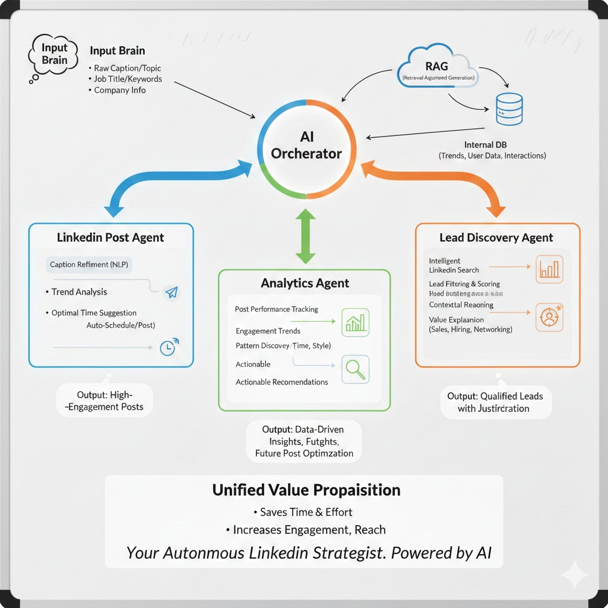

# LinkedIn AI Agent

A full-stack LinkedIn automation toolkit powered by multi-agent AI orchestration, Playwright browser automation, and a React frontend. It lets you create and schedule AI-polished posts, discover and rank leads, and analyze post performance — all from a single chat-driven interface.



---

## Table of Contents

- [Features](#features)
- [Tech Stack](#tech-stack)
- [Project Structure](#project-structure)
- [Backend Deep Dive](#backend-deep-dive)
  - [Entry Point](#entry-point)
  - [Post Module](#post-module)
  - [Lead Module](#lead-module)
  - [Analytics Module](#analytics-module)
  - [Scheduler](#scheduler)
- [API Reference](#api-reference)
- [Frontend Overview](#frontend-overview)
- [Setup & Installation](#setup--installation)
- [Environment Variables](#environment-variables)
- [Data Flow](#data-flow)

---

## Features

| Feature | Description |
|---|---|
| **AI Post Creation** | Chat with an agent to draft, polish, and publish LinkedIn posts |
| **Post Scheduling** | Schedule posts for any future time using natural language ("tomorrow at 3pm") |
| **Lead Discovery** | Search LinkedIn by job title, location, industry, and keywords — leads scored 0–100 for relevance |
| **Analytics Insights** | Scrape your own post performance data and ask an AI to surface trends and best-performing content |

---

## Tech Stack

**Backend**
- [FastAPI](https://fastapi.tiangolo.com/) — async Python web framework
- [OpenAI Agents SDK](https://github.com/openai/openai-agents-python) — multi-agent orchestration with handoffs
- [OpenRouter](https://openrouter.ai/) — LLM gateway (Mistral 3B model by default)
- [Playwright](https://playwright.dev/python/) — headless browser automation for LinkedIn
- [APScheduler](https://apscheduler.readthedocs.io/) — background job scheduling
- [Pydantic](https://docs.pydantic.dev/) — data validation and structured agent outputs

**Frontend**
- React 18 + TypeScript
- Vite 6
- Tailwind CSS 4
- Radix UI + shadcn/ui component library
- Recharts (data visualization)

---

## Project Structure

```
linkedin/
├── main.py                    # FastAPI server — mounts all routers
├── post.py                    # Standalone LinkedIn posting script
├── pyproject.toml             # Python project & dependency config
├── cookies.json               # Persisted LinkedIn session cookies
├── analytics.json             # Scraped post performance data (generated)
├── scheduled_jobs.json        # Persisted scheduled post queue (generated)
├── ai_orchestrator.jpeg       # Architecture diagram
│
├── post/                      # Post creation & scheduling module
│   ├── api.py                 # POST /agents/post/chat endpoint
│   ├── run.py                 # Orchestration runner
│   ├── schemas.py             # LinkedInPostRequest Pydantic model
│   ├── scheduler/
│   │   ├── api.py             # GET /scheduler/jobs endpoint
│   │   └── scheduler.py      # Job persistence & timed execution
│   ├── agents_1/
│   │   ├── orchestrator.py   # Multi-phase conversation orchestrator agent
│   │   └── structured_agent.py # Final validation agent (outputs LinkedInPostRequest)
│   └── tools/
│       ├── caption_tool.py    # AI caption polishing tool
│       ├── time_tool.py       # Natural language → ISO 8601 time parser
│       └── linkedin_post_tool.py # Playwright automation: login + post
│
├── lead/                      # Lead discovery module
│   ├── api.py                 # POST /agents/lead/search endpoint
│   ├── run.py                 # Agent runner for lead search
│   ├── schemas.py             # SearchFilters, Lead, LeadsList models
│   ├── agents_1/
│   │   ├── main_agent.py     # StructuredLeadsAgent — collects & structures leads
│   │   └── reasoning_agent.py # ReasoningAgent — scores and ranks leads
│   └── tools/
│       └── linkedin_search_tool.py # Playwright: search URL construction + scraping
│
├── analytics/                 # Post performance analytics module
│   ├── api.py                 # POST /agents/analytics/chat endpoint
│   ├── run.py                 # Agent runner for analytics queries
│   ├── analytics_agent.py    # AnalyticsAgent — reads analytics.json, computes metrics
│   ├── analytics_scraper.py  # LinkedInAnalyticsScraper — Playwright scraping
│   └── utility/
│       └── time_extractor.py # Decodes LinkedIn post timestamps from activity IDs
│
└── ui/                        # React frontend
    ├── src/
    │   ├── App.tsx            # Root shell with tab navigation
    │   ├── components/        # PostAgent, LeadsAgent, AnalyzerAgent, etc.
    │   ├── lib/api.ts         # Typed API client
    │   └── components/ui/    # 40+ shadcn/ui components
    └── package.json
```

---

## Backend Deep Dive

### Entry Point

**`main.py`** spins up the FastAPI application and wires everything together:

```python
app.include_router(post_router)       # /agents/post/...
app.include_router(analytics_router)  # /agents/analytics/...
app.include_router(lead_router)       # /agents/lead/...
app.include_router(scheduler_router)  # /scheduler/...
```

- CORS is configured to allow requests from the React dev server at `localhost:5173`
- A Windows-compatible `asyncio` event loop policy is applied at startup

---

### Post Module

The most complex module. It runs a **three-phase multi-agent pipeline** for post creation.

#### Conversation Flow

```
User message
    ↓
orchestrator.py  ←── Phase 1: Collect input (caption idea, file path, mode, time)
    ↓
caption_writer_tool  ←── Polishes caption using Mistral via OpenRouter
parse_time_tool      ←── Converts "tomorrow 3pm" → ISO 8601 (Asia/Karachi tz)
    ↓
structured_agent.py  ←── Validates & emits final LinkedInPostRequest
    ↓
run.py               ←── Decides: post now vs. schedule
    ├── mode="now"       → calls linkedin_post_tool immediately
    └── mode="schedule"  → save_job() + background schedule_post()
```

#### Key Files

**`agents_1/orchestrator.py`**
The main conversational agent. It collects four pieces of information from the user across multiple turns:
1. Caption idea or topic
2. Media file path (image or video)
3. Mode: `"now"` or `"schedule"`
4. Scheduled time (if applicable)

Once all inputs are gathered, it invokes the caption and time tools, then hands off to the structured agent.

**`agents_1/structured_agent.py`**
A final-stage agent that receives the processed data and outputs a validated `LinkedInPostRequest` Pydantic model. It enforces the rule that `scheduled_time` must be `null` for `"now"` mode and a valid ISO 8601 string for `"schedule"` mode.

**`tools/caption_tool.py`** — `caption_writer_tool`
- Takes a raw caption idea from the user
- Returns a polished, professional LinkedIn post under 200 words
- Adds relevant emojis and formatting
- Powered by Mistral 3B via OpenRouter

**`tools/time_tool.py`** — `parse_time_tool`
- Accepts natural language time expressions ("next Monday 9am", "in 2 hours")
- Always anchors to the **Asia/Karachi (PKT, UTC+5)** timezone
- Validates that the resolved time is at least 1 minute in the future
- Returns an ISO 8601 string or an `ERROR:` message if the time is in the past

**`tools/linkedin_post_tool.py`** — Playwright automation
The most involved tool. It automates the entire LinkedIn posting flow:
1. Loads stored cookies from `cookies.json`; falls back to credential-based login if cookies are expired
2. Navigates to LinkedIn and clicks "Start a post"
3. Fills in the caption text
4. If a media file path is provided, triggers the file chooser and uploads the file
5. Handles the media editor modal (Next → Done)
6. Clicks the Post button and waits for the success toast notification

**`scheduler/scheduler.py`**
- `save_job()` — appends the scheduled post metadata to `scheduled_jobs.json`
- `schedule_post()` — sleeps until the target timestamp, then executes `linkedin_post_tool`

---

### Lead Module

Finds and ranks LinkedIn profiles based on user-defined search criteria.

#### Agent Pipeline

```
LeadSearchRequest (filters + limit)
    ↓
main_agent.py (StructuredLeadsAgent)
    ├── linkedin_search_tool  ← Playwright scrapes LinkedIn search results
    └── reasoning_agent_tool  ← Scores each lead 0–100 for relevance
    ↓
LeadsList (structured Pydantic output)
```

#### Key Files

**`tools/linkedin_search_tool.py`**
Constructs a LinkedIn People Search URL from the provided filters and scrapes the result page using Playwright. For each result it extracts:
- Name, headline, location, profile URL
- Connection degree (1st, 2nd, 3rd+)

Logs each phase clearly: `[COOKIES]`, `[SEARCH]`, `[SCRAPE]`.

**`agents_1/reasoning_agent.py`** — `ReasoningAgent`
Exported as the `score_and_rank_leads` tool. Given raw profile data and the original search filters, it:
- Assigns a relevance score (0–100) to each profile
- Provides a one-line explanation for each score
- Filters out weak matches and returns a ranked list

**`schemas.py`**

| Model | Fields |
|---|---|
| `SearchFilters` | job_title, location, keywords, industry |
| `RawLinkedInProfile` | name, title, company, headline, skills, location, linkedin_url |
| `ScoredLead` | name, linkedin_url, relevance_score, explanation |
| `Lead` | name, linkedin_url, role, company, location, relevance_score, explanation, connectionDegree |
| `LeadsList` | leads: List[Lead] |

---

### Analytics Module

Lets you ask natural language questions about your LinkedIn post performance.

#### Key Files

**`analytics_scraper.py`** — `LinkedInAnalyticsScraper`
Navigates to your LinkedIn activity feed, expands truncated posts, and extracts performance data for up to 20 recent posts. For each post it records:

```json
{
  "post_id": "<hash>",
  "post_url": "<url>",
  "posted_time_iso": "2025-11-03T10:30:00Z",
  "posted_time_human": "3 weeks ago",
  "likes": 42,
  "comments": 7,
  "reposts": 2,
  "content_preview": "Excited to share...",
  "media_url": "<url or null>"
}
```

Results are saved to `analytics.json`.

**`analytics_agent.py`** — `AnalyticsAgent`
Reads `analytics.json` and answers user questions. It computes:
- **Engagement score** = likes + (comments × 2) for each post
- Best performing content types (text, image, video)
- Optimal posting times based on historical engagement

**`utility/time_extractor.py`**
Decodes the Unix timestamp embedded in a LinkedIn post's activity ID by reading the first 42 bits of the ID's binary representation — no external API call needed.

---

### Scheduler

**`post/scheduler/api.py`** — `GET /scheduler/jobs`
Returns all pending scheduled posts from `scheduled_jobs.json`:

```json
{
  "count": 2,
  "jobs": [
    {
      "caption": "Excited to share...",
      "file_path": "media/photo.jpg",
      "run_at": "2025-12-01T15:00:00+05:00"
    }
  ]
}
```

**`post/scheduler/scheduler.py`**
`schedule_post()` is run as a FastAPI `BackgroundTask`. It calculates the delay in seconds from now to the target `run_at` timestamp, sleeps, then calls `linkedin_post_tool` with the stored caption and file path.

---

## API Reference

| Method | Endpoint | Description |
|---|---|---|
| `POST` | `/agents/post/chat` | Send a message to the Post Agent |
| `GET` | `/scheduler/jobs` | List all scheduled posts |
| `POST` | `/agents/analytics/chat` | Ask the Analytics Agent a question |
| `POST` | `/agents/lead/search` | Search and score LinkedIn leads |

### `POST /agents/post/chat`

**Request**
```json
{
  "message": "I want to post about my new project launch",
  "session_id": "abc123"
}
```

**Response**
```json
{
  "session_id": "abc123",
  "status": "scheduled",
  "response": {
    "caption": "🚀 Thrilled to announce...",
    "file_path": "media/launch.png",
    "mode": "schedule",
    "run_at": "2025-12-01T15:00:00+05:00"
  }
}
```

### `POST /agents/lead/search`

**Request**
```json
{
  "filters": {
    "job_title": "Product Manager",
    "location": "Dubai",
    "industry": "SaaS",
    "keywords": "B2B growth"
  },
  "limit": 5,
  "session_id": "xyz789"
}
```

**Response**
```json
{
  "session_id": "xyz789",
  "status": "success",
  "data": [
    {
      "name": "Jane Smith",
      "linkedin_url": "https://linkedin.com/in/janesmith",
      "role": "Senior Product Manager",
      "company": "Acme SaaS",
      "location": "Dubai, UAE",
      "relevance_score": 91,
      "explanation": "Exact title match, B2B SaaS background, Dubai-based",
      "connectionDegree": "2nd"
    }
  ]
}
```

### `POST /agents/analytics/chat`

**Request**
```json
{
  "message": "What type of content gets the most engagement?",
  "session_id": "sess001"
}
```

**Response**
```json
{
  "session_id": "sess001",
  "response": "Your video posts average 3x more engagement than text-only posts...",
  "history": []
}
```

---

## Frontend Overview

The React frontend (`ui/`) provides three tabbed views, each backed by one of the backend agents:

| Tab | Component | Backend Endpoint |
|---|---|---|
| **Posts** | `PostAgent.tsx` | `/agents/post/chat` |
| **Analytics** | `AnalyzerAgent.tsx` | `/agents/analytics/chat` |
| **Leads** | `LeadsAgent.tsx` | `/agents/lead/search` |

**`PostAgent.tsx`** — split-panel layout with a chat interface on the left and a live LinkedIn post preview on the right. Shows status badges (`draft`, `scheduled`, `posted`) and a panel listing all queued scheduled jobs.

**`AnalyzerAgent.tsx`** — chat interface with rendered KPI cards and engagement charts powered by Recharts.

**`LeadsAgent.tsx`** — filter form (job title, location, industry, keywords, limit) that returns a grid of scored lead cards.

**`lib/api.ts`** — typed API client that wraps all `fetch` calls. The base URL is configurable via `VITE_API_BASE_URL` (defaults to `http://localhost:8000`).

---

## Setup & Installation

### Prerequisites
- Python 3.11+
- Node.js 18+
- A LinkedIn account
- An [OpenRouter](https://openrouter.ai/) API key

### Backend

```bash
# Install Python dependencies
pip install -e .

# Install Playwright browsers
playwright install chromium

# Copy and fill in environment variables
cp .env.example .env

# Start the API server
python main.py
# Runs on http://127.0.0.1:8000
```

### Frontend

```bash
cd ui
npm install
npm run dev
# Runs on http://localhost:5173
```

---

## Environment Variables

Create a `.env` file in the project root:

```env
# OpenRouter / DeepSeek API key (used for all LLM calls)
DEEPSEEK_API_KEY=your_openrouter_api_key

# LinkedIn credentials (used for cookie-based login fallback)
LINKEDIN_EMAIL=your@email.com
LINKEDIN_PASSWORD=your_password

# Optional: alternative LLM providers
GEMINI_API_KEY=
Llama_API_KEY=

# Optional: Pushover push notifications
pushover=your_app_token
pushover_user=your_user_key
```

> **Note:** LinkedIn credentials are only used as a fallback when stored cookies in `cookies.json` have expired. The app prefers reusing saved sessions to avoid repeated logins.

---

## Data Flow

### Post Creation & Scheduling

```
User chat message
  → POST /agents/post/chat
  → orchestrator.py collects: topic, file path, mode, time
  → caption_writer_tool: polishes caption text
  → parse_time_tool: converts natural language time → ISO 8601
  → structured_agent.py: emits validated LinkedInPostRequest
  → run.py:
      if mode="now"      → linkedin_post_tool() immediately
      if mode="schedule" → save_job() + background schedule_post()
                            (sleeps until run_at, then posts)
```

### Lead Discovery

```
Search filters
  → POST /agents/lead/search
  → linkedin_search_tool: Playwright scrapes People Search results
  → reasoning_agent_tool: scores each profile 0–100 vs. filters
  → returns ranked LeadsList
```

### Analytics

```
POST /agents/analytics/chat
  → analytics_agent reads analytics.json
  → computes engagement = likes + (comments × 2)
  → answers user question with insights
```

---

## Notes

- **Timezone:** All scheduled times are resolved in the **Asia/Karachi (PKT, UTC+5)** timezone by default.
- **Cookie Persistence:** LinkedIn session cookies are stored in `cookies.json` so repeated runs don't require fresh logins. If cookies expire, the tool falls back to credential login automatically.
- **Data Persistence:** Scheduled jobs are stored in `scheduled_jobs.json` and analytics data in `analytics.json`. Both files are generated at runtime.
- **LLM Model:** The default model is `mistralai/mistral-3b` routed through OpenRouter. This can be changed in each agent file by updating the `model` parameter.
